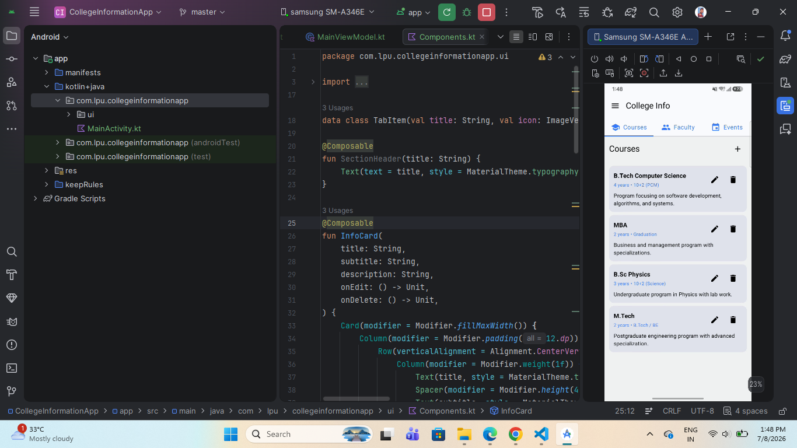

# 🎓 College Information App

A modern Android application built using **Kotlin** and **Jetpack Compose** that helps users manage college information through an intuitive and responsive interface. The application allows users to view, add, edit, and delete **Courses**, **Faculty Members**, and **College Events** using Material 3 components and the MVVM architecture.

---

## 📖 About

The **College Information Management App** is designed to organize important college data in a simple and user-friendly way. It demonstrates modern Android development practices using **Jetpack Compose**, **ViewModel**, **Material 3**, and state management. The application includes CRUD operations, a Navigation Drawer, Tab Layout, and Snackbar feedback, making it an excellent learning project for Android developers.

---

## ✨ Features

- 📚 Manage Courses
- 👨‍🏫 Manage Faculty Information
- 🎉 Manage College Events
- ➕ Add New Records
- ✏️ Edit Existing Records
- 🗑️ Delete Records
- 📑 Tab-Based Navigation
- 📂 Navigation Drawer
- 🔔 Snackbar Notifications
- 📝 Input Forms using AlertDialog
- 🎨 Material 3 Design
- 📱 Fully Responsive Jetpack Compose UI
- 🏗️ MVVM Architecture

---

## 🛠️ Technologies Used

- Kotlin
- Jetpack Compose
- Material 3
- Android ViewModel
- State Management
- Snackbar
- AlertDialog
- LazyColumn
- Navigation Drawer
- Android Studio

---

## 📂 Project Structure

```
app/
│
├── MainActivity.kt
├── ui/
│   ├── MainScreen.kt
│   ├── MainViewModel.kt
│   ├── Components.kt
│   ├── model/
│   │   ├── Course.kt
│   │   ├── Faculty.kt
│   │   └── CollegeEvent.kt
│   └── theme/
│
└── AndroidManifest.xml
```

---

# 📱 Screenshot
# 📱 Screenshot

<p align="center">
  
</p>

---

## 🚀 Application Modules

### 🏠 Home Screen

Displays:

- Navigation Drawer
- Top App Bar
- Tab Layout
- Dynamic Lists

---

### 📚 Courses Module

Users can:

- View Courses
- Add New Courses
- Edit Course Details
- Delete Courses

Each course contains:

- Course Name
- Duration
- Eligibility
- Description

---

### 👨‍🏫 Faculty Module

Users can:

- View Faculty Members
- Add Faculty
- Edit Faculty Information
- Delete Faculty

Faculty details include:

- Name
- Department
- Designation
- Email
- Phone Number

---

### 🎉 Events Module

Users can:

- View College Events
- Add Events
- Edit Events
- Delete Events

Each event contains:

- Event Name
- Date
- Venue
- Description

---

### 📂 Navigation Drawer

Provides quick navigation options:

- Home
- About College
- Contact Us
- Settings

---

## 🎨 UI Components

The application uses reusable Compose components including:

- TopAppBar
- Navigation Drawer
- TabRow
- Cards
- AlertDialog
- Snackbar
- LazyColumn
- Material Icons
- Floating Add Buttons
- Custom List Headers

---

## 🧠 Architecture

The application follows the **MVVM (Model-View-ViewModel)** architecture.

### Model

- Course
- Faculty
- CollegeEvent

### View

- Jetpack Compose UI

### ViewModel

- Manages application state
- Handles selected tabs
- Stores mock data
- Updates UI automatically

---

## 🚀 Future Improvements

- Room Database Integration
- Firebase Authentication
- Cloud Firestore
- Student Management Module
- Attendance Management
- Search Functionality
- Sorting & Filtering
- Profile Management
- Dark Mode
- Image Upload for Faculty
- Notifications for Upcoming Events

---

## ⚙️ Installation

Clone the repository:

```bash
git clone https://github.com/yourusername/CollegeInformationApp.git
```

Open the project in **Android Studio**.

Sync Gradle and run the application on an emulator or Android device.

---

## 📸 Screenshot

Place your screenshot inside the project folder:

```
CollegeInformationApp/
│
├── README.md
├── college_information_ui.png
```

---

## 🎯 Learning Outcomes

This project demonstrates practical knowledge of:

- Kotlin Programming
- Jetpack Compose
- Material 3
- MVVM Architecture
- ViewModel
- State Management
- LazyColumn
- AlertDialog
- Snackbar
- Navigation Drawer
- Tab Layout
- CRUD Operations
- Reusable Composable Functions
- Responsive Android UI Design

---

## 👨‍💻 Author

**Vishal Dhiman**

**B.Tech Student | Android Developer**

Passionate about Android Development, Kotlin, Jetpack Compose, and building modern Android applications.

---
